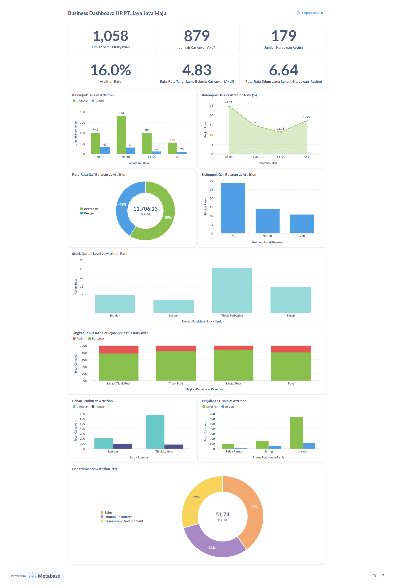

# 💼 Proyek Data Science: Prediksi Resign Karyawan di PT Jaya Jaya Maju

## 🧠 1. Business Understanding

**PT Jaya Jaya Maju** adalah perusahaan multinasional yang berdiri sejak tahun 2000 dan memiliki lebih dari 1.000 karyawan di seluruh Indonesia.  
Namun, meskipun telah tumbuh besar, perusahaan masih menghadapi tantangan serius dalam hal **retensi karyawan**, dengan **attrition rate** yang menembus angka **10%**.

Divisi HR memerlukan pendekatan **data science** untuk:

-   Mengidentifikasi faktor utama yang menyebabkan karyawan resign
-   Membangun **model machine learning** untuk prediksi resign
-   Menyediakan **business dashboard** untuk memantau kondisi karyawan secara real-time

---

## ❓ 2. Permasalahan Bisnis

💡 Beberapa permasalahan bisnis yang ingin dijawab:

-   👶 Mengapa karyawan muda (usia 20–30 tahun) lebih rentan resign?
-   💰 Apakah gaji, benefit, dan stock option sudah kompetitif?
-   😊 Seberapa besar pengaruh kepuasan kerja dan lingkungan kerja?
-   🕒 Apa dampak lembur dan perjalanan dinas terhadap burnout?
-   🧪 Mengapa tingkat resign tertinggi terjadi di departemen R&D?

---

## 🔍 3. Cakupan Proyek

A. 📥 Pengambilan & inspeksi data karyawan

B. 🧹 Pembersihan data dari:

-   Missing value
-   Invalid data
-   Duplicate data
-   Inaccurate value
-   Inconsistent value
-   Outlier

C. 📊 Exploratory Data Analysis (EDA) mencakup:

-   Distribusi numerik & kategorikal
-   Korelasi antar fitur
-   Visualisasi insight

D. ⚙️ Feature engineering:

-   Seleksi fitur
-   Transformasi & scaling

E. 🤖 Model training dengan algoritma machine learning

F. 🧪 Evaluasi model menggunakan confusion matrix

---

## 🧰 4. Persiapan

-   **Dataset**: [Jaya Maju Dataset](https://github.com/dicodingacademy/dicoding_dataset/tree/main/employee)
-   **Python**: 3.11
-   **Setup Environment**:
    ```bash
    python -m venv hr-problem-analysis-project
    hr-problem-analysis-project\Scripts\activate
    pip install -r requirements.txt
    pip install streamlit
    ```
-   **Metabase acess:**

    **Email**: root@mail.com

    **Password**: root123

---

## 📈 5. Business Dashboard

Dashboard interaktif dibuat untuk membantu tim HR dalam memantau dan menganalisis faktor-faktor penyebab karyawan resign, seperti:

-   👶 Usia
-   💰 Benefit
-   😊 Tingkat Kepuasan Kerja
-   ⏰ Beban Kerja
-   🛫 Frekuensi Perjalanan Dinas
-   🧪 Departemen

🎯 Dashboard ini menyajikan **insight visual** berdasarkan hasil analisis dan model machine learning untuk mendukung pengambilan keputusan secara **data-driven**.



---

## 📌 6. Kesimpulan

### 🔍 A. Data Overview

-   📊 Jumlah data: **1.470 baris × 35 kolom**
-   ⚠️ Data belum dibersihkan dari:
    -   Missing value
    -   Duplikasi
    -   Kolom tidak relevan

---

### 🔎 B. Data Assessment

#### ❓ Missing Values

-   Kolom `Attrition` memiliki **412 data hilang**
-   Tergolong **MNAR (Missing Not At Random)**
-   Proporsi: **28% dari total data Attrition**

#### ✅ Duplicate Check

-   Tidak ditemukan duplikasi data

#### 🔢 Numerical Features

-   `Age`, `DailyRate`, `DistanceFromHome`, `HourlyRate`, `MonthlyIncome`, `MonthlyRate`
-   `NumCompaniesWorked`, `PercentSalaryHike`, `StandardHours`, `TotalWorkingYears`
-   `TrainingTimesLastYear`, `YearsAtCompany`, `YearsInCurrentRole`, `YearsSinceLastPromotion`, `YearsWithCurrManager`

#### 🔢 Ordinal Features

-   `Education`, `EnvironmentSatisfaction`, `JobInvolvement`, `JobLevel`, `JobSatisfaction`
-   `PerformanceRating`, `RelationshipSatisfaction`, `StockOptionLevel`, `WorkLifeBalance`

#### 🔠 Nominal Features

-   `Attrition`, `BusinessTravel`, `Department`, `EducationField`, `Gender`
-   `JobRole`, `MaritalStatus`, `Over18`, `OverTime`

#### 📊 Distribusi

-   Sebagian besar fitur numerik memiliki distribusi **right-skewed**
-   Disebabkan oleh keberadaan **outlier**

---

### 📊 C. Exploratory Data Analysis

**Aspek Demografi**

-   👶 Usia muda (20–30 tahun) → lebih rentan resign
-   💍 Belum menikah → lebih sering resign
-   🎓 Lulusan S1 & Life Sciences → cenderung resign
-   👩‍⚕️ Jenis kelamin & jarak rumah tidak terlalu berpengaruh
-   🧑‍💼 Pengalaman kerja rendah → lebih rentan resign

**Aspek Kepuasan**

-   😊 Kepuasan kerja tinggi → risiko resign menurun
-   🌿 Lingkungan kerja buruk → memicu resign
-   🤝 Hubungan sosial positif → retensi lebih tinggi
-   ⚖️ Work-life balance rendah → lebih mudah resign

**Aspek Karier**

-   🧪 Laboratory Technician & Research Scientist → paling banyak resign
-   📉 Jabatan rendah → lebih berisiko
-   📊 Lama bekerja pendek → lebih mudah resign

**Aspek Kompensasi**

-   💰 Income tinggi → lebih bertahan
-   🪙 Stock option → meningkatkan loyalitas

**Aspek Beban Kerja**

-   ⏰ Lembur sering → memicu resign
-   ✈️ Perjalanan bisnis → berkorelasi dengan resign
-   🧬 R&D department → tingkat resign tertinggi

---

### 🤖 D. Modeling & Evaluation

Model machine learning terbaik: **Logistic Regression**

📈 Hasil evaluasi model:

| Metrik       | Nilai |
| ------------ | ----- |
| 🎯 Accuracy  | 84%   |
| 📌 Precision | 52%   |
| 🔁 Recall    | 75%   |
| 📊 F1-Score  | 62%   |

⚠️ \*Precision dan F1 rendah disebabkan oleh **ketidakseimbangan label Attrition\***

---

## ✅ 7. Rekomendasi Action Items

### 👶 A. Mengurangi Resign pada Karyawan Muda

-   🎓 Program onboarding & mentoring
-   🗂️ Job description yang jelas
-   🪜 Jalur karier progresif
-   🧠 Pelatihan & pengembangan rutin

### 💵 B. Meningkatkan Gaji & Benefit

-   📈 Evaluasi ulang struktur gaji
-   💎 Bonus berbasis performa
-   🏦 Perluas skema kepemilikan saham

### 😊 C. Meningkatkan Kepuasan & Lingkungan Kerja

-   📋 Survei rutin kepuasan kerja
-   🛠️ Implementasi perbaikan dari hasil survei
-   🤝 Lingkungan kolaboratif & suportif

### 🔥 D. Mengurangi Stress Kerja karena Lembur/Perjalanan

-   ⏰ Batasi lembur sesuai regulasi
-   🧾 Kompensasi lembur & istirahat
-   🖥️ Gunakan kerja jarak jauh bila memungkinkan

### 🧪 E. Menangani Tingginya Resign di R&D

-   ⚖️ Evaluasi ekspektasi & beban kerja
-   🧰 Sediakan tools & fasilitas yang memadai
-   💡 Libatkan tim R&D dalam proyek lintas fungsi

---

## 🎯 Penutup

Dengan strategi berbasis data, perusahaan **Jaya Jaya Maju** dapat:

-   📉 Menurunkan tingkat attrition
-   💡 Mengidentifikasi faktor penyebab resign
-   🧠 Mengambil keputusan lebih cerdas & cepat
-   🚀 Meningkatkan retensi karyawan dan produktivitas

---
